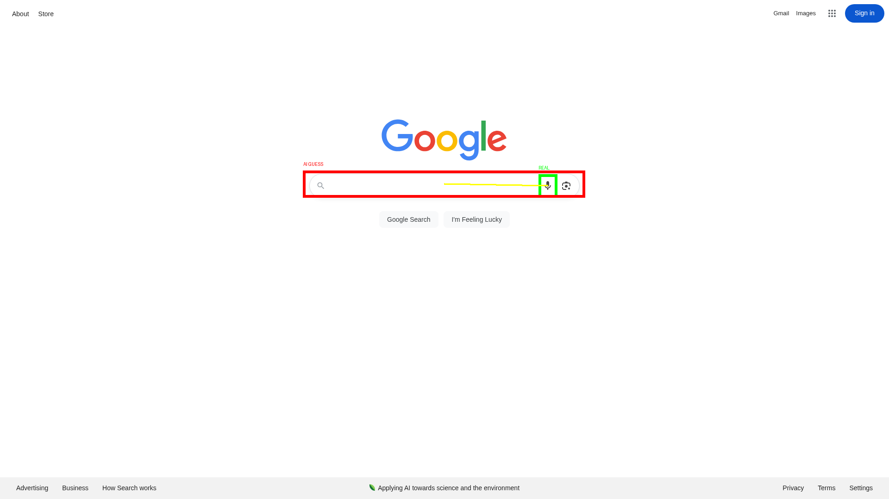

# I Tried to Teach AI to Click Buttons, and It Missed by 500 Pixels

## Building the Ultimate AI Web Agent: A Zero-to-Hero Journey (Part 1)

**The Dream:** Imagine telling your computer, "Go to Amazon, find a waterproof Bluetooth speaker under $50, and put it in my cart," and then watching your mouse cursor move on its own, clicking and typing exactly as you would.

This isn't sci-fi anymore. This is the promise of Multimodal AI Agents.

But if you think building this is as easy as taking a screenshot and asking ChatGPT to "click the button," I have bad news for you. I tried that. It failed hilariously.

In this series, **"Building the Ultimate AI Web Agent"**, I'm going to take you from a naive script that misses buttons to a robust, production-grade web agent.

Today, in Part 1, we explore how AI "sees," why we tried the easy way (Pixel Prediction), and the mathematical trap that ruined it all.

## Crash Course: What is a Multimodal LLM?

Before we break the code, let's understand the brain. You likely know LLMs (Large Language Models) like GPT-4 or Claude. They take text in and spit text out.

MLLMs (Multimodal Large Language Models) add a new sense: **Vision**.

### How does an AI "See"?

When you look at a website, you see a seamless flow of pixels. When an AI looks at a website, it sees a **Mosaic**.

1. **The Grid**: The model chops the screenshot into tiny fixed-size squares called "Patches" (e.g., $14 \times 14$ pixels).
2. **The Flattening**: Each patch is turned into a list of numbers (a vector).
3. **The Reasoning**: The AI analyzes these vectors just like words in a sentence. It understands that the pattern of pixels in the top-right corner "looks like" a login button.

This process is called **Visual Grounding**—mapping a text concept (e.g., "The Microphone Icon") to spatial coordinates on the screen.


## The Experiment: The "Naive" Approach

For our first attempt, we used **Qwen2-VL-2B**. Why Qwen? Unlike older models that force every image into a low-res square, Qwen is designed to handle various resolutions and natively supports bounding boxes—it can output `[x, y, x, y]` coordinates.

### The Plan

The logic was simple (or so I thought):

1. **Capture**: Take a screenshot of Google.com using Playwright.
2. **Ask**: Feed the image to Qwen with the prompt: "Find the bounding box of the Search by Voice icon."
3. **Click**: Convert the AI's coordinates into a mouse click.


### The Code

Here is the script we used. It asks the model for coordinates and draws a box on the screen to verify them.

```jupyter
import re
from PIL import Image, ImageDraw
from transformers import Qwen2VLForConditionalGeneration, AutoProcessor
from playwright.async_api import async_playwright
from qwen_vl_utils import process_vision_info
import torch

# 1. Setup
device = "cuda" if torch.cuda.is_available() else "cpu"
if 'model' not in locals():
    model = Qwen2VLForConditionalGeneration.from_pretrained("Qwen/Qwen2-VL-2B-Instruct", dtype="auto",
                                                            device_map=device)
    processor = AutoProcessor.from_pretrained("Qwen/Qwen2-VL-2B-Instruct")


async def find_and_verify_element(url, element_description):
    image_path = "page.png"

    # --- Capture ---
    async with async_playwright() as p:
        browser = await p.chromium.launch()
        page = await browser.new_page()
        await page.goto(url)
        # Using 1024x1024 to match model training resolution often helps accuracy
        await page.set_viewport_size({"width": 1024, "height": 1024})
        await page.screenshot(path=image_path)
        await browser.close()

    # --- Inference ---
    # We specifically ask for the center point to help the model allow for single-point precision
    prompt = f"Find the bounding box of the {element_description}."

    messages = [{
        "role": "user",
        "content": [{"type": "image", "image": image_path}, {"type": "text", "text": prompt}]
    }]

    text = processor.apply_chat_template(messages, tokenize=False, add_generation_prompt=True)
    image_inputs, video_inputs = process_vision_info(messages)
    inputs = processor(text=[text], images=image_inputs, padding=True, return_tensors="pt").to(device)

    generated_ids = model.generate(**inputs, max_new_tokens=128)
    output_text = processor.batch_decode(generated_ids, skip_special_tokens=True)[0]
    print(f"Model said: {output_text}")

    # --- Parse (The 'Chat' Logic: x, y, x, y) ---
    # Matches (213, 372...) or [213, 372...]
    pattern = r"\((\d+),\s*(\d+)\)\s*to\s*\((\d+),\s*(\d+)\)"
    match = re.search(pattern, output_text)

    if match:
        # Chat mode usually outputs [x_min, y_min, x_max, y_max]
        # If the result looks like a vertical strip, swap these variables.
        norm_x1, norm_y1, norm_x2, norm_y2 = map(int, match.groups())

        # Get Real Dimensions
        img = Image.open(image_path)
        W, H = img.size

        # Convert 0-1000 to Pixels
        x1 = (norm_x1 / 1000) * W
        y1 = (norm_y1 / 1000) * H
        x2 = (norm_x2 / 1000) * W
        y2 = (norm_y2 / 1000) * H

        center_x = (x1 + x2) / 2
        center_y = (y1 + y2) / 2

        print(f"Found Coordinates: Center({center_x:.1f}, {center_y:.1f})")

        # --- Verify Visual (Python Side) ---
        draw = ImageDraw.Draw(img)
        # Draw Box
        draw.rectangle([x1, y1, x2, y2], outline="red", width=4)
        # Draw Center
        r = 10
        draw.ellipse((center_x - r, center_y - r, center_x + r, center_y + r), fill="green", outline="black")

        # Save/Show result
        img.save("verified_result.png")
        return (center_x, center_y)
    else:
        print("No coordinates found.")
        return None


# Run
# Note: If you want the gray button specifically, try prompting: "the gray Google Search button below the text bar"
await find_and_verify_element("https://www.google.com", "Google Search button")
```

### Execution Log

```text
/usr/local/lib/python3.12/dist-packages/huggingface_hub/utils/_auth.py:94: UserWarning: 
The secret `HF_TOKEN` does not exist in your Colab secrets.
To authenticate with the Hugging Face Hub, create a token in your settings tab (https://huggingface.co/settings/tokens), set it as secret in your Google Colab and restart your session.
You will be able to reuse this secret in all of your notebooks.
Please note that authentication is recommended but still optional to access public models or datasets.
  warnings.warn(
config.json: 
 1.20k/? [00:00<00:00, 26.7kB/s]
model.safetensors.index.json: 
 56.4k/? [00:00<00:00, 1.16MB/s]
Download complete: 100%
 4.42G/4.42G [01:00<00:00, 66.9MB/s]
Fetching 2 files: 100%
 2/2 [01:00<00:00, 60.64s/it]
Loading weights: 100%
 729/729 [00:06<00:00, 124.67it/s, Materializing param=model.visual.patch_embed.proj.weight]
generation_config.json: 100%
 272/272 [00:00<00:00, 24.9kB/s]
preprocessor_config.json: 100%
 347/347 [00:00<00:00, 37.1kB/s]
The image processor of type `Qwen2VLImageProcessor` is now loaded as a fast processor by default, even if the model checkpoint was saved with a slow processor. This is a breaking change and may produce slightly different outputs. To continue using the slow processor, instantiate this class with `use_fast=False`. Note that this behavior will be extended to all models in a future release.
tokenizer_config.json: 
 4.19k/? [00:00<00:00, 378kB/s]
vocab.json: 
 2.78M/? [00:00<00:00, 42.8MB/s]
merges.txt: 
 1.67M/? [00:00<00:00, 44.4MB/s]
tokenizer.json: 
 7.03M/? [00:00<00:00, 74.5MB/s]
chat_template.json: 
 1.05k/? [00:00<00:00, 51.6kB/s]
Model said: system
You are a helpful assistant.
user
Find the bounding box of the Google Search button.
assistant
The Google Search button is located at the center of the image, just below the Google logo. The bounding box for the Google Search button is approximately from (211, 372) to (788, 430).
Found Coordinates: Center(511.5, 410.6)
(511.488, 410.624)
```


I ran this on a simple test page. **It worked!** The AI found the big "Google Search" button. I felt like a genius.

Then, I tried to click a small icon on a wide-screen monitor.

## The Failure: The "Pixel Trap"

To stress-test our agent, we set up a scenario that mimics real-world usage:

1. **The Monitor**: A standard wide screen ($1920 \times 1080$).
2. **The Target**: The small "Search by voice" (Microphone) icon.
3. **The Constraint**: Most AI models (including Qwen) prefer square inputs (e.g., $1024 \times 1024$).

We captured the screen and asked the AI to find the icon. Here is exactly what happened in the logs:

```text
Capturing https://www.google.com at 1920x1080...
Ground Truth (DOM): [1163, 377, 1203, 427]

Squashing image to 1024x1024 to trigger Scaling Drift...

Parsing Model Output:
"The bounding box is [341, 342, 658, 396]."
```

### The Math Doesn't Add Up

Do you see the discrepancy?

- **Reality (DOM)**: The icon starts at pixel **1163** (Right side).
- **AI Prediction**: The AI guessed **341** (Left side).

When we visualized this, the magnitude of the failure was shocking:



### Anatomy of a Missed Click

Why did our "smart" AI miss by 500 pixels?

#### 1. The Aspect Ratio Trap (The Squish)

We captured a wide 16:9 image, but the model processed it as a 1:1 square. This "squashed" the image horizontally.

- The AI saw the microphone at roughly 30% of the image width.
- When we mapped that 30% back to the 1920px screen, the math drifted massively.

#### 2. The Ambiguity Problem

Look at the <span style="color:red">Red Box</span> in the image above. The AI didn't just miss the coordinates; it boxed the entire search text input, not the microphone. To a human, the difference is obvious. To an AI looking at a squashed, low-resolution patch, the whole search bar looks like "The Search Thing."

#### The Result

If this were a live agent, it would have clicked the empty white space in the text bar. The script would report "Success," but nothing would happen. This is a **Silent Failure**—the worst enemy of automation.

## Key Takeaways

> "Asking for pixels is a trap."

1. **Vision is not precise**: MLLMs see general patterns, not exact pixels. They are probabilistic engines, not rulers.
2. **Scaling is the enemy**: Aspect ratio distortion between your screen and the model's training data causes "Math Drift."
3. **Context is ambiguous**: "Search button" might mean the icon, the text box, or the button below. The AI usually guesses the biggest one.

## What's Next?

We have hit a wall. We cannot rely on the AI to guess where pixels are. We need a way to force the AI to be precise.

In **Part 2**, we will abandon raw coordinate guessing. We will implement a technique called **Set-of-Mark (SoM)**. We will use JavaScript to inject numbered tags directly into the browser's code, giving the AI "glasses" to see exactly where elements are—with **100% precision**.

Stay tuned.